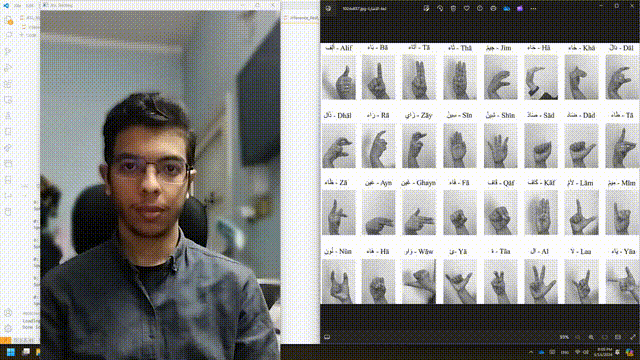

# Arabic Sign Language Real-Time Detection


## Overview

This project is a real-time detection system for Arabic Sign Language made by YOLOv8, we go through the process of training, evaluation, then implementation of the inference.

## Table of Contents

1. [Introduction](#introduction)
2. [Features](#features)
3. [Demo](#demo)
4. [Installation](#installation)
5. [Results](#results)

## Introduction

Arabic Sign Language(ASL): A visual-gestural language used by deaf and hard of hearing communities primarily in our Arabian world. Just like spoken languages, ASL has its own grammar, syntax, and vocabulary. It involves the use of handshapes, movements to convey meaning and communicate ideas. In recent years, there has been increased attention to developing technologies that facilitate the recognition and translation of ASL gestures, aiming to enhance accessibility and communication for individuals who use sign language.


- Dataset: [Link Text](https://www.kaggle.com/datasets/ammarsayedtaha/arabic-sign-language-dataset-2022)

## Features

- The ASL detection system is able to detect the gestures by predicting the boundary box of where the gesture is and what it describes as a label
- Works on Real-Time inference
- Utilizes any webcam to apply the inference

## Demo



## Installation

- The Project requires mainly installing Python (preferably 3.10 or higher) along with Jupyter.

- Installing PyTorch(Preferably with CUDA: [Link Text](https://pytorch.org/get-started/locally/) ),ultralytics, OpenCV, Matplotlib, and NumPy

```bash
pip install ultralytics
pip install opencv-python
pip install matplotlib
pip install numpy
```

## Results

- Metrics


- Predictions


## Presentation


